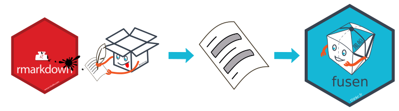
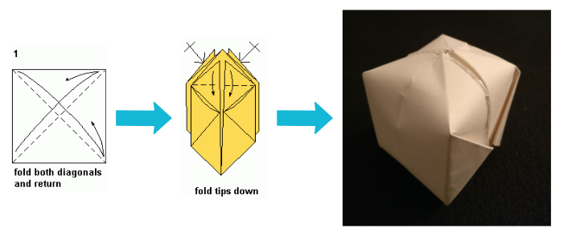
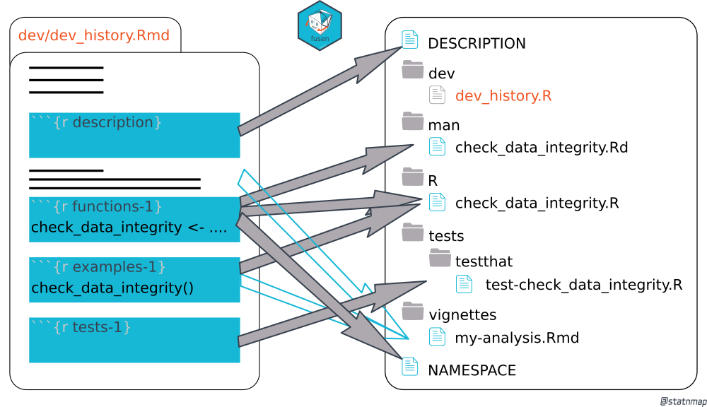
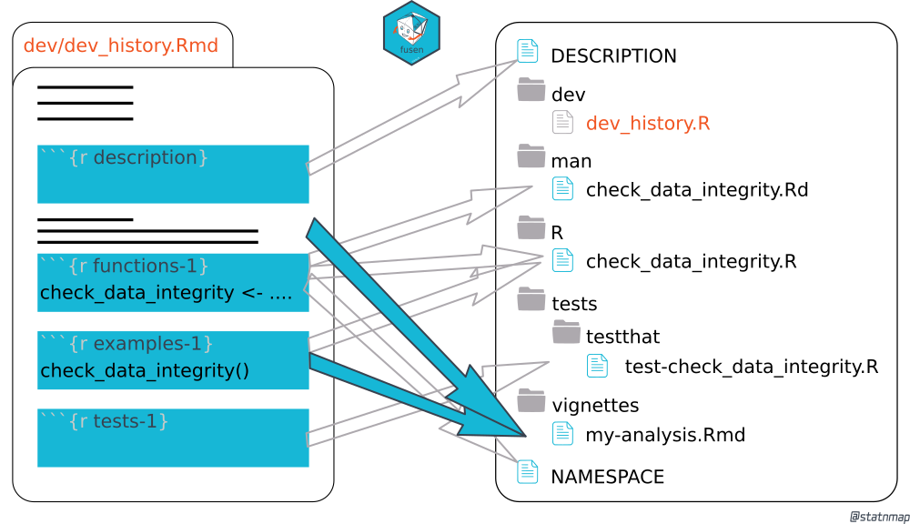

class: slide

### Antoine


* WUR Alumnus: Formerly part of PPS and Biometris

* Now happier than ever at ThinkR

Our English website: https://rtask.thinkr.fr/

Our Github: https://github.com/ThinkR-open/


---
class: slide

### Getting to know you

Who:

--

* use Rstudio?

--

* use Rstudio Projects?

--

* use Rmarkdown?

--

* has developed a package before?

--

* use git?

---
class: slide

### What is good code?

--

* Easy to use

--

* Readable

--

* Documented

--

* Has explicit dependencies

--

* Reliable 

--

* Shareable


---
class: slide

### Why write a package?

Well to be able to write good code as we just defined it!

The package structure meets all criteria:

--

- Documented -> Packages provide a standardize **documentation system**

--

- Explicit dependencies -> Packages provide a standardize way to deal with **dependencies**

--

- Reliable -> Packages provide a **testing** infrastructure

--

- Shareable -> Packages are the de facto **standard to share** code

---
class: slide

### How to write a package?

<br/>
<br/> 

> If you know how to create a Rmarkdown file, then you know how to build a package.

<br/>
<br/> 

```{r, echo=FALSE, out.width="70%"}

```

<br/>
<br/> 

Let's use {fusen} ! An R package developed by Sébastien Rochette.

---
class: slide

### What does {fusen} do ?

<br/>
<br/> 

```{r, echo=FALSE, out.width="90%"}

```

---
class: center middle inverse title-slide

## Start a fusen project
### Get a piece of paper

---

class: center middle inverse title-slide

## Fill in the flat template
### Fold your paper

---

class: center middle inverse title-slide

## Inflate your package!
### Blow!

---
class: slide

### What just happened?

```{r development-1, eval=FALSE, echo=TRUE}
fusen::inflate(rmd = "dev/flat_cranology.Rmd")
```

--

*functions*

```{r, echo=FALSE, out.width="90%"}

```

---
class: slide

### What just happened?

```{r development-1b, eval=FALSE, echo=TRUE}
fusen::inflate(rmd = "dev/flat_cranology.Rmd")
```

*vignette*

```{r, echo=FALSE, out.width="90%"}

```

---
class: slide

### Try it out yourself !

```{r, eval=FALSE}
install.packages("fusen")
```

Checkout the documentation

https://thinkr-open.github.io/fusen

and/or the source code

https://github.com/ThinkR-open/fusen


---

class: center middle inverse title-slide

## Thanks!
### Questions?